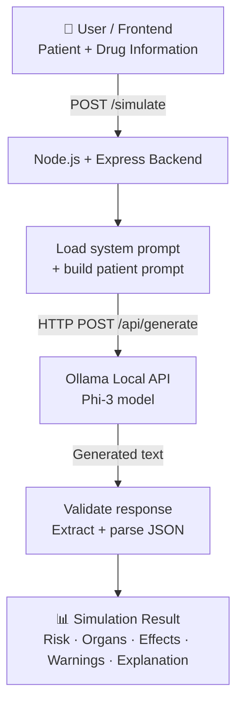

<div align="center">

# 🧬 Digital Twin

### AI-Powered Patient Drug-Effect Simulation

A hackathon project that combines **Digital Twin concepts** with a **locally hosted LLM (Phi-3 via Ollama)** to simulate how a drug may affect a virtual patient and return a **structured JSON risk assessment**.


</div>

> [!WARNING]
> **Educational prototype only.** This project is **not** a medical diagnosis or treatment system and has not been clinically validated. Never use its output for real clinical or health decisions.

---

## 📑 Table of Contents

- [Overview](#-overview)
- [Problem Statement](#-problem-statement)
- [Key Features](#-key-features)
- [Architecture](#-architecture)
- [Tech Stack](#-tech-stack)
- [Project Structure](#-project-structure)
- [Getting Started](#-getting-started)
- [API Reference](#-api-reference)
- [How It Works](#-how-it-works)
- [Error Handling](#-error-handling)
- [Limitations](#-limitations)
- [Roadmap](#-roadmap)
- [Security](#-security)
- [About the Hackathon](#-about-the-hackathon)
- [License](#-license)

---

## 🚀 Overview

A **digital twin** is a virtual representation of a real-world entity. This project applies that idea to a **patient**: given a patient's profile and a drug scenario, the system simulates possible effects and produces a machine-readable assessment.

**Inputs**

| Field | Description |
|---|---|
| `age` | Patient age |
| `conditions` | Existing medical conditions |
| `drug` | Drug name |
| `dosage` | Drug dosage |

**Outputs**

- Overall risk level (`LOW` / `MEDIUM` / `HIGH`)
- Organ-level risk for **heart**, **kidney**, and **liver** (`low` / `medium` / `high`)
- Possible effects
- Warnings
- Plain-language explanation

Everything runs **locally** through Ollama, so no patient-style data is sent to a cloud AI provider.

---

## 🎯 Problem Statement

Understanding how a medication may affect different organs depends on several patient-specific factors: age, existing conditions, drug type, and dosage.

This project explores how **Generative AI + patient-specific input + Digital Twin concepts** can be combined into an interactive simulation. Instead of returning free-form text, the system returns a **structured result** that a frontend can render directly (dashboards, organ indicators, alerts).

---

## ✨ Key Features

| Feature | Description |
|---|---|
| 👤 **Patient simulation** | `/simulate` accepts patient and drug data and builds a simulation request |
| 💊 **Drug-effect reasoning** | LLM simulates possible effects based on the supplied profile |
| 🫀 **Organ-level risk** | Separate risk levels for heart, kidney, and liver |
| ⚠️ **Overall risk classification** | `LOW`, `MEDIUM`, or `HIGH` |
| 🔒 **Local inference** | Phi-3 runs on your machine via Ollama, no cloud AI key required |
| 📦 **Structured JSON output** | Fixed schema designed for easy frontend consumption |
| 🛡️ **Response validation** | Handles HTTP errors, empty responses, missing JSON, and invalid JSON |

---

## 🏗️ Architecture



### Request lifecycle

1. Client sends patient and drug data to `POST /simulate`.
2. Backend loads `prompts/system_prompt.txt` and combines it with the patient data.
3. Backend calls Ollama (`phi3`, non-streaming) and instructs it to return **only valid JSON**.
4. Backend checks the HTTP status, extracts the JSON object with a regular expression, and parses it.
5. The parsed result is returned to the client, or a descriptive error if any step fails.

---

## 🧰 Tech Stack

| Technology | Purpose |
|---|---|
| **Node.js** | Backend runtime |
| **Express.js** | Web server and REST API |
| **EJS** | Server-side view rendering |
| **Ollama** | Local LLM runtime |
| **Phi-3** | Language model used for simulation |
| **dotenv** | Environment configuration |

> `package.json` also lists Mongoose, JWT, OpenAI, and Google GenAI dependencies. These are not used by the active `/simulate` flow and are reserved for future extensions.

---

## 📁 Project Structure

```text
DigitalTwin/
├── prompts/
│   └── system_prompt.txt   # System prompt + expected JSON schema
├── server.js               # Express server, /simulate route, Ollama integration
├── package.json
├── package-lock.json
└── README.md
```

---

## ⚡ Getting Started

### Prerequisites

- [Node.js](https://nodejs.org/) (LTS recommended)
- [Ollama](https://ollama.com/)
- Enough local resources to run the `phi3` model

### Installation

**1. Clone the repository**

```bash
git clone https://github.com/MallikarjunJD/DigitalTwin.git
cd DigitalTwin
```

**2. Install dependencies**

```bash
npm install
```

**3. Download the Phi-3 model**

```bash
ollama pull phi3
```

**4. Make sure Ollama is running**

The app expects the Ollama API at `http://localhost:11434`.

**5. Configure environment variables**

Create a `.env` file in the project root:

```env
PORT=3000
```

**6. Start the server**

```bash
node server.js
```

You should see:

```text
listening on port 3000
```

---

## 🔌 API Reference

### `POST /simulate`

Runs a patient drug-effect simulation.

**Request**

```http
POST /simulate
Content-Type: application/json
```

```json
{
  "age": 45,
  "conditions": ["condition A"],
  "drug": "Example Drug",
  "dosage": "5 mg"
}
```

**Successful response**

```json
{
  "risk_level": "MEDIUM",
  "organs": {
    "heart": "medium",
    "kidney": "low",
    "liver": "low"
  },
  "effects": ["Example simulated effect"],
  "warnings": ["Example simulated warning"],
  "explanation": "Example simulation explanation."
}
```

**Response schema**

| Field | Type | Values |
|---|---|---|
| `risk_level` | string | `LOW` · `MEDIUM` · `HIGH` |
| `organs.heart` | string | `low` · `medium` · `high` |
| `organs.kidney` | string | `low` · `medium` · `high` |
| `organs.liver` | string | `low` · `medium` · `high` |
| `effects` | string[] | Possible simulated effects |
| `warnings` | string[] | Simulated warnings |
| `explanation` | string | Summary of the reasoning |

> All values above are illustrative and are **not** medical predictions. Exact output depends on the model response.

**Try it with curl**

Linux / macOS:

```bash
curl -X POST http://localhost:3000/simulate \
  -H "Content-Type: application/json" \
  -d '{"age":45,"conditions":["condition A"],"drug":"Example Drug","dosage":"5 mg"}'
```

Windows (CMD):

```bat
curl -X POST http://localhost:3000/simulate ^
  -H "Content-Type: application/json" ^
  -d "{\"age\":45,\"conditions\":[\"condition A\"],\"drug\":\"Example Drug\",\"dosage\":\"5 mg\"}"
```

You can also use Postman, Thunder Client, or a frontend form.

### `GET /patient-data`

Renders the `patientForm.ejs` view, intended as the patient input interface.

---

## 🧠 How It Works

### System prompt design

The prompt (`prompts/system_prompt.txt`) defines the model's role as:

> *a medical simulation engine acting as a digital twin of a patient*

It asks the model to reason over **age, conditions, drug, and dosage**, and to answer using a fixed JSON structure (`risk_level`, `organs`, `effects`, `warnings`, `explanation`). This structured-output approach makes the response predictable and easy for a UI to consume.

### Ollama request

```json
{
  "model": "phi3",
  "prompt": "<system prompt + patient data + 'Return ONLY valid JSON.'>",
  "stream": false
}
```

### Robust JSON extraction

Language models sometimes wrap JSON in extra text. The backend therefore searches the model output for a `{ ... }` block with a regular expression, then runs `JSON.parse()` on it. Malformed output is never forwarded to the client.

---

## 🔄 Error Handling

| Scenario | Response |
|---|---|
| Ollama returns a non-success HTTP status | `{ "error": "Ollama HTTP error" }` |
| Ollama response is missing or empty | `{ "error": "Invalid Ollama response" }` |
| No JSON object found in model output | `{ "error": "No JSON found in response" }` |
| Extracted JSON cannot be parsed | `{ "error": "JSON parse failed" }` |
| Unexpected server failure | `{ "error": "Server crash" }` |

---

## ⚠️ Limitations

- **Not clinically validated.** Output comes from a general-purpose small language model, not a medical knowledge base.
- **Non-deterministic.** The same input can produce different results across runs.
- **Format-level validation only.** The backend verifies that the output is valid JSON; it does not yet verify that every field matches the expected schema or allowed values.
- **Limited scope.** Only three organs (heart, kidney, liver) are modeled, and no drug-interaction database is used.

---

## 🗺️ Roadmap

These are proposed ideas and are **not** implemented yet.

- [ ] Interactive patient risk dashboard
- [ ] Simulation history and persistence
- [ ] Schema validation of model output
- [ ] Richer patient digital twin profiles
- [ ] Larger medication knowledge base with Retrieval-Augmented Generation (RAG)
- [ ] User authentication and authorization
- [ ] Automated API tests
- [ ] Responsive / mobile interface
- [ ] Multilingual support
- [ ] Support for additional local LLMs
- [ ] Integration with standard healthcare data formats

---

## 🔐 Security

- Never commit secrets or private configuration.
- If future versions add API keys or database credentials, store them in `.env` and make sure `.env` is listed in `.gitignore`.
- The current `/simulate` flow uses Ollama locally and requires no cloud AI API key.

---

## 🏆 About the Hackathon

This project was built as a **hackathon project** to demonstrate how Generative AI can power a healthcare simulation workflow.

| | |
|---|---|
| **Project** | Digital Twin |
| **Domain** | Generative AI · Healthcare Simulation |
| **Backend** | Node.js + Express.js |
| **LLM Runtime** | Ollama |
| **Model** | Phi-3 |
| **Repository** | [MallikarjunJD/DigitalTwin](https://github.com/MallikarjunJD/DigitalTwin) |

The core idea:

```text
Patient Profile + Drug Information
              ↓
        AI Simulation
              ↓
 Structured Risk & Effect Output
```

---

## 📜 Disclaimer

This application is a **hackathon and educational prototype**. It does **not** provide medical diagnosis, treatment recommendations, or clinically validated drug-safety predictions. Do not use its output for real-world medical decisions. Always consult a qualified healthcare professional.

---

## 📄 License

Distributed under the **ISC License**, as specified in `package.json`.

---

<div align="center">

Built with ❤️ during a hackathon by [MallikarjunJD](https://github.com/MallikarjunJD)

⭐ If you found this project interesting, consider giving it a star!

</div>
